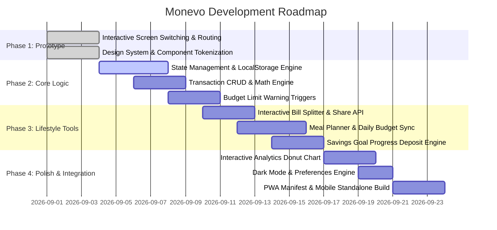

# Monevo — Product & Technical Analysis Document
> **Tagline:** *Smart Money. Smarter Student Life.*  
> **Brand Identity:** Money + Evolution  
> **Target Audience:** University and college students  
> **Repository:** [github.com/thomaslm009-hkm/Monevo-](https://github.com/thomaslm009-hkm/Monevo-)

---

## 1. Executive Summary & Vision

**Monevo** is a specialized, all-in-one personal finance platform tailored for university students. While generic finance tools focus heavily on corporate budgeting, investment portfolios, or single-use utilities, Monevo unifies daily expense tracking, meal budget planning, student discounts, restaurant discovery, bill splitting with roommates, and semester savings goals into a clean, mobile-first ecosystem.

### Core Problems Solved:
1. **Friction in Daily Tracking:** Students neglect manual expense tracking due to cluttered corporate finance apps.
2. **Overspending on Dining & Lifestyle:** Food is one of the highest variable student expenses; Monevo links meal planning directly to financial limits.
3. **Roommate & Group Debt Friction:** Splitting utilities, groceries, and rent currently requires switching between disparate apps (e.g., Splitwise, spreadsheets, banking apps).
4. **Lack of Long-Term Semester Goal Visibility:** Difficulty saving for tuition, laptops, emergency funds, or trips.

---

## 2. Competitive Landscape & Monevo Differentiation

| Feature / Solution | Generic Expense Trackers (Spendee, Money Mgr) | Bill Splitters (Splitwise) | Budget Tools (YNAB, Mint) | **Monevo** |
| :--- | :---: | :---: | :---: | :---: |
| **Student Lifestyle Focus** | ❌ No | ❌ No | ❌ No | ✅ **Dedicated** |
| **Meal Planning & Budget Link**| ❌ No | ❌ No | ❌ No | ✅ **Built-in** |
| **Campus Deals & Student Discounts** | ❌ No | ❌ No | ❌ No | ✅ **Integrated** |
| **Roommate Bill Splitting** | ❌ No | ✅ Core | ❌ No | ✅ **Built-in** |
| **Simple Zero-Friction UI** | ⚠️ Complex | ⚠️ Limited Scope | ⚠️ High Learning Curve | ✅ **Mobile-First & Clean** |

---

## 3. Screen Breakdown & Functional Specifications

Based on [`monevo_app_screens.html`](./monevo_app_screens.html) and [`Monevo Presentation.pdf`](./Monevo%20Presentation.pdf), the app consists of **12 primary screens / functional views**:

```
 ┌─────────────────────────────────────────────────────────────────────────────┐
 │                                MONEVO APP                                   │
 └──────┬──────────────────────────────┬──────────────────────────────┬────────┘
        │                              │                              │
 ┌──────▼──────┐                ┌──────▼──────┐                ┌──────▼──────┐
 │ Onboarding  │                │  Core App   │                │ Lifestyle   │
 ├─────────────┤                ├─────────────┤                ├─────────────┤
 │ 01. Splash  │                │ 03. Home    │                │ 06. Meals   │
 │ 02. Auth    │                │ 04. Tracker │                │ 07. Places  │
 │ 12. Profile │                │ 05. Budget  │                │ 08. Split   │
 │             │                │ 11. Insights│                │ 09. Goals   │
 │             │                │             │                │ 10. Deals   │
 └─────────────┘                └─────────────┘                └─────────────┘
```

---

### Screen 01: Splash Screen
- **Purpose:** Brand introduction, initial asset preloading, and authentication check.
- **UI Elements:**
  - Monevo gradient arrow/growth logo mark (`#2ECC71` to `#2E86DE`).
  - Brand tagline: *"Smart Money. Smarter Student Life."*
  - Loading bar animation indicating initialization.
- **State Logic:** If valid auth token exists in `localStorage`, navigate directly to `Home (03)`; otherwise transition to `Login / Sign Up (02)`.

---

### Screen 02: Login & Authentication
- **Purpose:** Onboarding, identity verification, and student account creation.
- **UI Elements:**
  - Tab toggle: **Log In** vs **Register**.
  - Student email input (e.g. `.edu` / university domain support).
  - Password field with show/hide toggle.
  - Social Auth buttons: Google & Apple SSO.
- **Validation Rules:**
  - Valid email format.
  - Password minimum 6 characters.
  - Optional `.edu` tag detection to grant automatic "Verified Student" badge.

---

### Screen 03: Home Dashboard
- **Purpose:** High-level summary of financial standing and fast action shortcuts.
- **UI Elements:**
  - Header with user greeting and notification badge.
  - Gradient Total Balance card with current monthly spending progress (`$487 / $800`).
  - **Quick Action Grid:**
    - `➕ Add` -> opens Add Transaction (04)
    - `🧾 Split` -> opens Bill Splitter (08)
    - `🐷 Save` -> opens Savings Goals (09)
    - `🏷️ Deals` -> opens Student Discounts (10)
  - **Recent Transactions Feed:** Icon, category name, timestamp, and signed currency (`+$120.00` / `-$8.40`).
  - Bottom Tab Navigation bar.

---

### Screen 04: Expense Tracker / Add Transaction
- **Purpose:** Quick logging of income and expenses.
- **UI Elements:**
  - Segmented control: **Income** vs **Expense**.
  - Large amount input display (numeric keypad or formatted input).
  - Category selector grid with visual icons:
    - 🍔 Food
    - 🚌 Transport
    - 🏠 Rent & Housing
    - 🎮 Fun & Entertainment
    - 📚 Books & Tuition
    - ➕ Custom / Other
  - Date selector & optional note field.
  - Primary CTA: **Save Transaction**.

---

### Screen 05: Budget Planner
- **Purpose:** Monthly spending allocations, limit enforcement, and warning alerts.
- **UI Elements:**
  - Circular progress gauge showing total budget utilization (e.g., `61% used`).
  - Proactive warning cards (e.g. `⚠ Close to your Food limit — You've used 92%`).
  - Category budget breakdown progress bars (Food, Transport, Entertainment, etc.).
  - Budget edit modal / adjustment sliders.

---

### Screen 06: Meal Planner
- **Purpose:** Connecting meal planning with daily food budgeting.
- **UI Elements:**
  - 7-day calendar strip (Mon - Sun selector).
  - Daily meal budget tracker (e.g., `$12.50 / $15.00 spent`).
  - Structured meal cards by time of day:
    - 🌅 Breakfast (e.g. Oatmeal & fruit - $2.20)
    - ☀️ Lunch (e.g. Campus cafeteria rice & veg - $5.30)
    - 🌙 Dinner (e.g. Home-cooked pasta - $5.00)
  - Quick action to add meal and log associated expense.

---

### Screen 07: Restaurant Finder
- **Purpose:** Discover local affordable dining and campus-area student deals.
- **UI Elements:**
  - Search bar (`"Nearby affordable eats"`).
  - Filter chips: `All`, `$`, `$$`, `Student Deals`.
  - Restaurant cards displaying:
    - Place name & thumbnail
    - Distance (`0.4 mi`) & cuisine tag
    - Price tier badge (`$` / `$$`)
    - Special student discount badge (`🎓 10% student discount`).

---

### Screen 08: Bill Splitter
- **Purpose:** Quick bill division among roommates, group dinners, or shared supplies.
- **UI Elements:**
  - Bill Total input (`$50.00`).
  - Counter control: Number of people with `+` and `–` buttons.
  - Participant avatar bubbles with custom names.
  - Calculated output banner: **Each person pays: `$12.50`**.
  - Action buttons: **💬 Message** (share breakdown via SMS/WhatsApp) and **🔗 Copy Link**.

---

### Screen 09: Savings Goals
- **Purpose:** Long-term target tracking for students.
- **UI Elements:**
  - Header with `+ New Goal` button.
  - Progress cards with SVG ring progress indicators:
    - 💻 *New Laptop* ($450 / $900 — ~3 months left)
    - ✈️ *Spring Break Trip* ($120 / $480 — ~6 months left)
    - 🛟 *Emergency Fund* ($380 / $500 — ~1 month left)
  - Quick deposit modal to allocate money to a goal.

---

### Screen 10: Student Discounts & Deals
- **Purpose:** Curated catalog of student perks and verified promotions.
- **UI Elements:**
  - Category chips: `All`, `Food`, `Tech`, `Fashion`, `Services`.
  - Deal cards with brand icon, description, and discount pill (`20% OFF`, `15% OFF`).
  - Student verification banner (`🎓 Verify your student email to unlock more deals`).

---

### Screen 11: Spending Analytics & Insights
- **Purpose:** Financial visual reports and habit analysis.
- **UI Elements:**
  - Timeframe selector: `This month` vs `Last month`.
  - Multi-colored Donut Chart (Rent 38%, Food 25%, Fun 19%, Transport 18%).
  - Comparison insight badge: `▼ 12% less than last month`.
  - Category legend list with exact amounts and percentages.

---

### Screen 12: Profile & App Settings
- **Purpose:** Account management, preferences, and customization.
- **UI Elements:**
  - User avatar with initials (`AR`), display name, and university email.
  - Settings list:
    - 👤 Edit Profile
    - 🔒 Security & Passcode
    - 🔔 Notifications & Budget Alerts
    - 🌙 Dark Mode Toggle
    - 🚪 Log Out CTA (Coral color)

---

## 4. Data Models & State Architecture

For development, the data store can be managed with a unified state structure (using `localStorage` for offline persistence or a REST backend):

```typescript
// Core Data Schema

interface UserProfile {
  id: string;
  name: string;
  email: string;
  avatarInitials: string;
  isStudentVerified: boolean;
  currency: string; // e.g. "$"
  darkMode: boolean;
}

interface Transaction {
  id: string;
  type: 'income' | 'expense';
  amount: number;
  category: 'Food' | 'Transport' | 'Rent' | 'Fun' | 'Books' | 'Income' | 'Other';
  title: string;
  date: string; // ISO 8601
  note?: string;
}

interface CategoryBudget {
  category: string;
  limit: number;
  spent: number;
}

interface MealItem {
  id: string;
  dayOfWeek: 'Mon' | 'Tue' | 'Wed' | 'Thu' | 'Fri' | 'Sat' | 'Sun';
  mealType: 'breakfast' | 'lunch' | 'dinner';
  title: string;
  tag: string;
  cost: number;
}

interface Restaurant {
  id: string;
  name: string;
  priceLevel: '$' | '$$' | '$$$';
  distance: string;
  cuisine: string;
  studentDiscount?: string;
  imageUrl?: string;
}

interface BillSplit {
  id: string;
  totalAmount: number;
  numberOfPeople: number;
  participants: string[];
  perPersonAmount: number;
  note?: string;
}

interface SavingsGoal {
  id: string;
  title: string;
  icon: string;
  currentAmount: number;
  targetAmount: number;
  targetDate?: string;
  estimatedMonthsLeft: number;
}

interface StudentDeal {
  id: string;
  category: 'Food' | 'Tech' | 'Fashion' | 'Services';
  brand: string;
  description: string;
  discountRate: string;
  icon: string;
  promoCode?: string;
}
```

---

## 5. Design System & CSS Variables

The app utilizes a design system that reflects modern mobile app standards:

```css
:root {
  /* Color Palette */
  --navy: #12233F;        /* Deep midnight header/accent */
  --navy-2: #1C355C;      /* Secondary dark tone */
  --green: #2ECC71;       /* Positive cash flow / success */
  --blue: #2E86DE;        /* Primary brand blue */
  --bg: #F2F6FB;          /* Light ambient background */
  --card: #FFFFFF;        /* Elevated container background */
  --slate: #7C8AA0;       /* Muted text and inactive icons */
  --slate-light: #E7EDF6; /* Borders, dividers, track bars */
  --coral: #FF6B6B;       /* Expenses, alerts, destructive CTAs */
  --gold: #F0A93A;        /* Warnings, badges, promo pills */

  /* Gradients */
  --grad: linear-gradient(120deg, var(--green), var(--blue));
  --grad-soft: linear-gradient(135deg, rgba(46,204,113,0.14), rgba(46,134,222,0.14));

  /* Typography */
  --font-brand: 'Sora', sans-serif;
  --font-body: 'Inter', sans-serif;
  --font-mono: 'IBM Plex Mono', monospace;
}
```

---

## 6. Project Directory & File Structure

The project follows a clean, modular structure:

```
Monevo/
│
├── index.html
│
├── pages/
│   ├── login.html
│   ├── dashboard.html
│   ├── expenses.html
│   ├── budget.html
│   ├── meal-planner.html
│   ├── restaurant.html
│   ├── bill-splitter.html
│   ├── savings.html
│   ├── analytics.html
│   ├── discounts.html
│   └── profile.html
│
├── css/
│   └── style.css
│
├── js/
│   └── app.js
│
└── images/
    └── monevo-logo.png
```

### File & Directory Role Mapping:

| Path | Associated Screen | Key Responsibilities |
| :--- | :--- | :--- |
| **`index.html`** | Screen 01 (Splash) | App entry point, brand splash screen, session check & redirection |
| **`pages/login.html`** | Screen 02 (Auth) | Student login, registration, password recovery, SSO buttons |
| **`pages/dashboard.html`** | Screen 03 (Home) | Total balance card, quick shortcuts, recent transactions feed |
| **`pages/expenses.html`** | Screen 04 (Tracker) | Income/expense switcher, amount input, category tag selector |
| **`pages/budget.html`** | Screen 05 (Budget) | Monthly spending gauge, category limits & near-limit warning cards |
| **`pages/meal-planner.html`** | Screen 06 (Meals) | 7-day strip, breakfast/lunch/dinner daily expense budget tracking |
| **`pages/restaurant.html`** | Screen 07 (Dining) | Affordable restaurant finder, price filters, student discount tags |
| **`pages/bill-splitter.html`** | Screen 08 (Split) | Per-person calculation, roommate avatars, share breakdown button |
| **`pages/savings.html`** | Screen 09 (Goals) | Semester target savings rings, remaining time estimates, deposits |
| **`pages/discounts.html`** | Screen 10 (Deals) | Verified student perks, promo codes, brand deal cards |
| **`pages/analytics.html`** | Screen 11 (Insights) | Donut chart breakdowns, monthly spending comparison insights |
| **`pages/profile.html`** | Screen 12 (Profile) | Student profile, security, notifications, dark mode toggle, logout |
| **`css/style.css`** | *Global Styling* | Centralized design tokens, color palette, card components, nav bars |
| **`js/app.js`** | *Global Logic* | State engine, `localStorage` persistence, calculations & event routing |
| **`images/`** | *Media Assets* | Brand logos, marks, icons, and illustrations |

---

## 7. Implementation Roadmap & Development Phases



### Phase 1: Interactive Single-App Shell
- Convert the static 12-screen gallery into a navigable, single-page application (SPA).
- Provide bottom tab switching (Home, Track, Insights, Profile) and modal/page transitions for sub-features (Split, Meals, Goals, Deals).

### Phase 2: State Engine & Transaction Tracking
- Implement standard data store with auto-save to `localStorage`.
- Support adding/deleting transactions, updating live balance, and category recalculations.
- Implement budget threshold alerts when category spending crosses >85%.

### Phase 3: Interactive Lifestyle Modules
- **Bill Splitter Engine:** Real-time per-person recalculation upon changing total or head count, with Web Share API or Clipboard integration.
- **Meal Budget Sync:** Adding meals dynamically calculates against the daily food limit.
- **Savings Goals Progress:** Allow users to deposit funds into target goals.

### Phase 4: Visual Analytics & PWA
- Dynamic SVG or Canvas-based interactive pie/donut charts for category breakdown.
- Complete Dark Mode theme variables.
- Offline support via Service Worker / PWA manifest.

---

## 8. Key Testing & Quality Assurance Checklist

- [ ] **Currency Math Precision:** Ensure floating point roundoff errors are eliminated using integer cents or `toFixed(2)`.
- [ ] **Bill Split Edge Cases:** Handle bill division remainders cleanly (e.g. $10.00 / 3 = $3.33 each with remainder noted).
- [ ] **Zero-Data / First Launch States:** Provide engaging empty states when transactions, meals, or goals have not yet been created.
- [ ] **Responsive Breakpoints:** Smooth rendering on compact mobile screens (320px width) up to desktop/tablet previews.
- [ ] **Form Validation:** Guard against negative amounts, blank titles, and invalid date formats.
